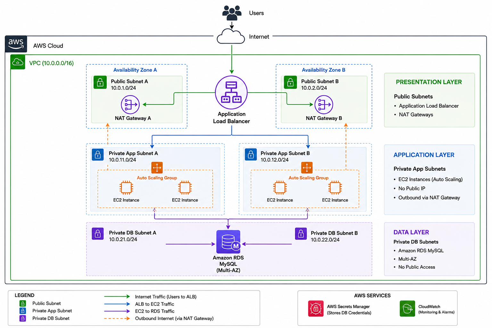
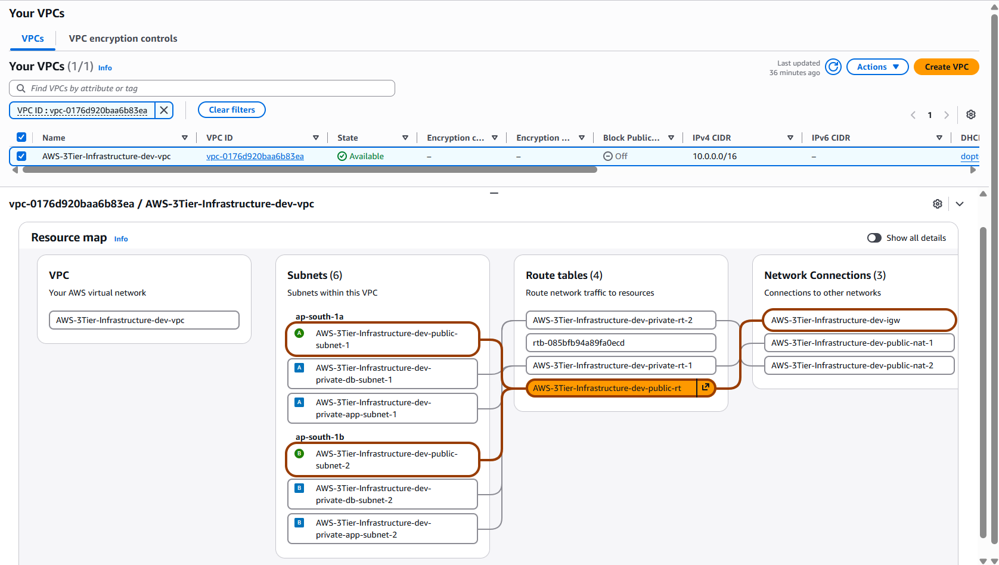
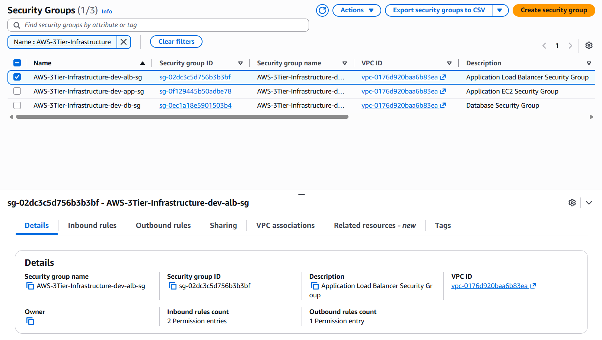
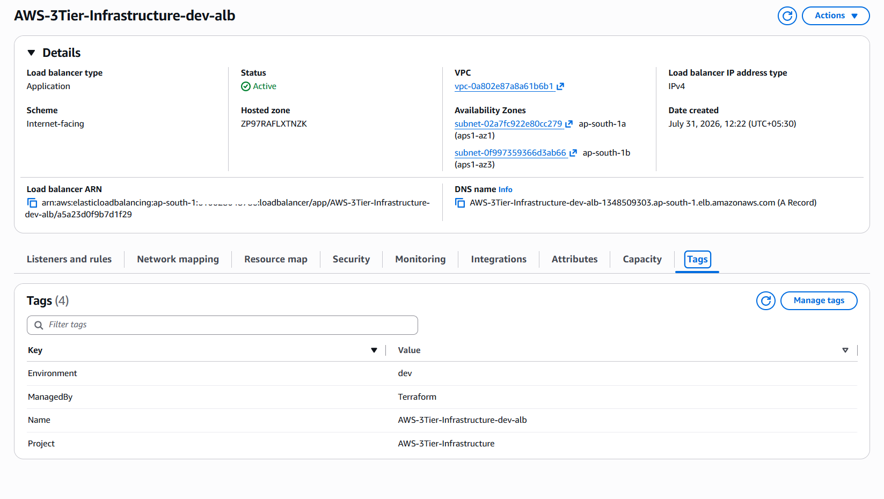
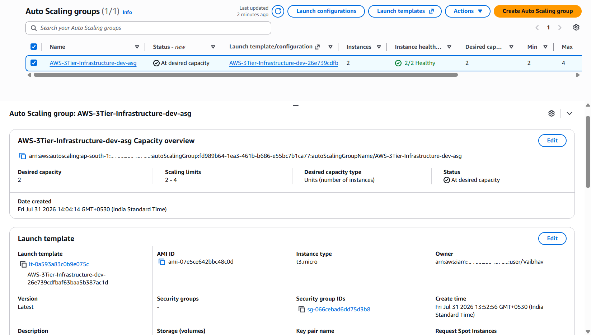
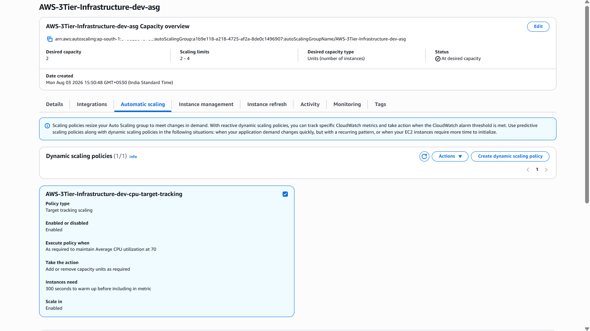
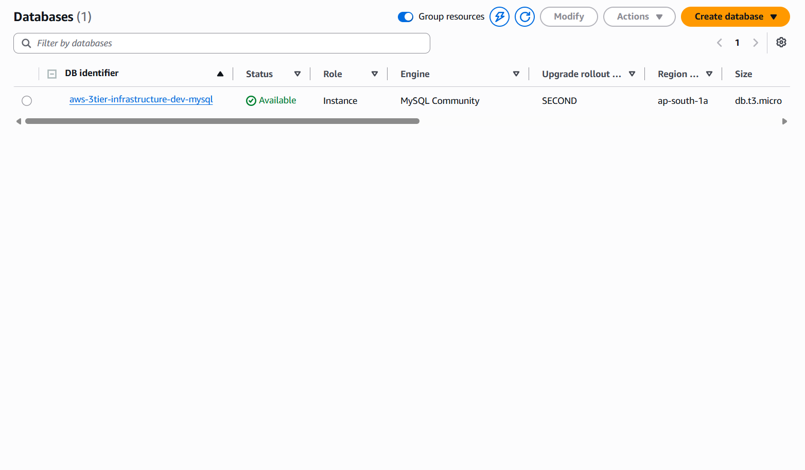
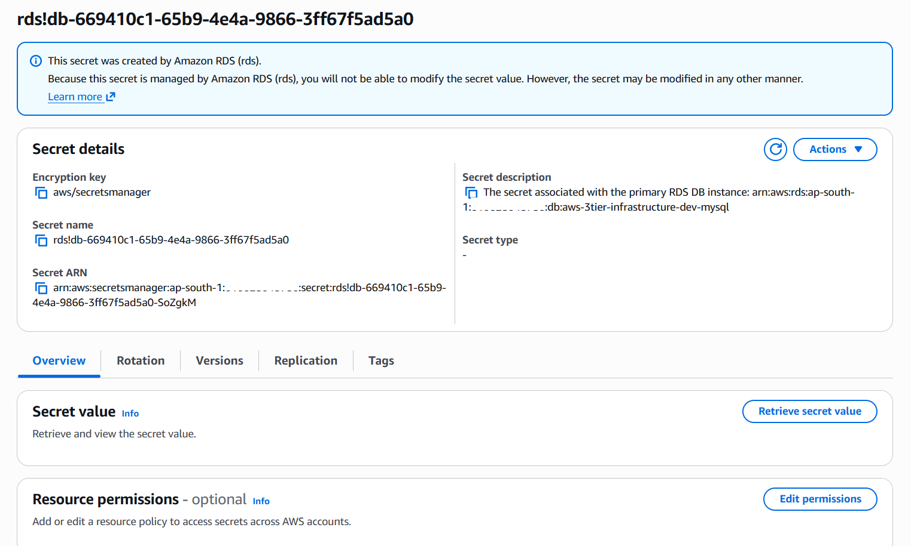
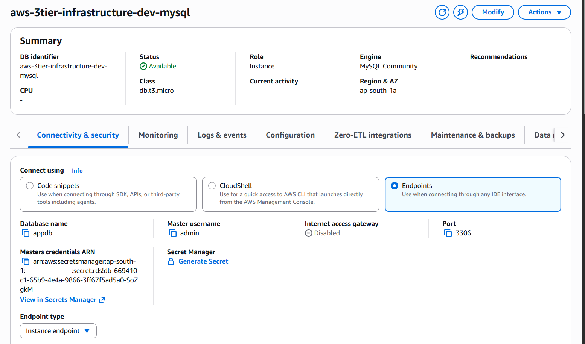

# AWS 3-Tier Infrastructure using Terraform

A production-inspired Infrastructure as Code (IaC) project that provisions a highly available AWS 3-tier architecture using Terraform.

The infrastructure follows AWS best practices by separating the Presentation, Application, and Data layers while using reusable Terraform modules.

---

## Architecture



---

## Features

- Modular Terraform architecture
- Multi-AZ deployment
- Public and private subnets
- Internet Gateway
- Highly Available NAT Gateways
- Route Tables
- Security Groups
- Application Load Balancer
- Launch Template
- Auto Scaling Group
- Target Tracking Auto Scaling Policy
- IAM Role & Instance Profile
- Amazon RDS MySQL
- AWS Secrets Manager integration
- EC2 bootstrapping using User Data

---

## Repository Structure

```
AWS_3-Tier_Infrastructure
├── docs/
|   └── architecture.png
├── screenshots/
├── terraform/
|   ├── environments/
|   │   └── dev/
|   └── modules/
|       ├── autoscaling/
|       ├── database/
|       ├── iam/
|       ├── load-balancer/
|       ├── networking/
|       ├── security-group/
|       └── vpc/
├── .gitignore
├── LICENSE
└── README.md
```

---

## Infrastructure Components

| Component      | Service                   |
|----------------|---------------------------|
| Networking     | Amazon VPC                |
| Load Balancer  | Application Load Balancer |
| Compute        | EC2 Auto Scaling Group    |
| Database       | Amazon RDS MySQL          |
| Credentials    | AWS Secrets Manager       |
| Identity       | IAM                       |
| Monitoring     | CloudWatch                |
| Infrastructure | Terraform                 |

---

## Deployment

### 1. Clone the repository

```bash
git clone https://github.com/VaibhavDW789/AWS_3-Tier_Infrastructure.git
cd AWS_3-Tier_Infrastructure
```

### 2. Create your Terraform variables file

Navigate to the development environment and copy the example file:

```bash
cd terraform/environments/dev

cp ./terraform.tfvars.example terraform.tfvars
```

Or simply rename/copy:

```text
terraform.tfvars.example
        ↓
terraform.tfvars
```

Update the values in `terraform.tfvars` to match your AWS environment, such as:

- Project name
- AWS Region
- VPC CIDR
- Availability Zones
- Subnet CIDRs
- Instance type
- Database configuration

> **Note:** The `terraform.tfvars` file is intentionally excluded from Git to prevent committing environment-specific or sensitive configuration.

### 3. Initialize Terraform

```bash
terraform init
```

### 4. Validate the configuration

```bash
terraform validate
```

### 5. Review the execution plan

```bash
terraform plan
```

### 6. Deploy the infrastructure

```bash
terraform apply
```

### 7. Destroy the infrastructure

```bash
terraform destroy
```

---

## Infrastructure Preview

<table>
  <tr>
    <td align="center">
      <br>
      <b>Architecture</b>
    </td>
    <td align="center">
      <br>
      <b>Amazon VPC</b>
    </td>
    <td align="center">
      <br>
      <b>Security Groups</b>
    </td>
  </tr>

  <tr>
    <td align="center">
      <br>
      <b>Application Load Balancer</b>
    </td>
    <td align="center">
      <br>
      <b>Auto Scaling Group</b>
    </td>
    <td align="center">
      <br>
      <b>Target Tracking Policy</b>
    </td>
  </tr>

  <tr>
    <td align="center">
      <br>
      <b>Amazon RDS</b>
    </td>
    <td align="center">
      <br>
      <b>Secrets Manager</b>
    </td>
    <td align="center">
      <br>
      <b>RDS Connectivity & Security</b>
    </td>
  </tr>
</table>

## Screenshots

Detailed screenshots for every implementation step are available in the `screenshots/` directory.

```
screenshots/
├── application/
├── autoscaling/
├── database/
├── iam/
├── load-balancer/
├── networking/
├── security-group/
├── terraform/
└── vpc/
```

This folder contains Terraform execution, AWS Console verification, and deployment screenshots for that module.

---

## Future Improvements

- Dockerized application deployment
- Jenkins CI/CD Pipeline
- Amazon ECR
- CloudWatch Dashboard
- HTTPS using ACM
- Route 53
- WAF
- Monitoring with Prometheus & Grafana

---

## Learning Outcomes

This project demonstrates practical experience with:

- Infrastructure as Code
- AWS Networking
- High Availability
- Auto Scaling
- IAM
- Secrets Management
- Terraform Modules
- Git & GitHub